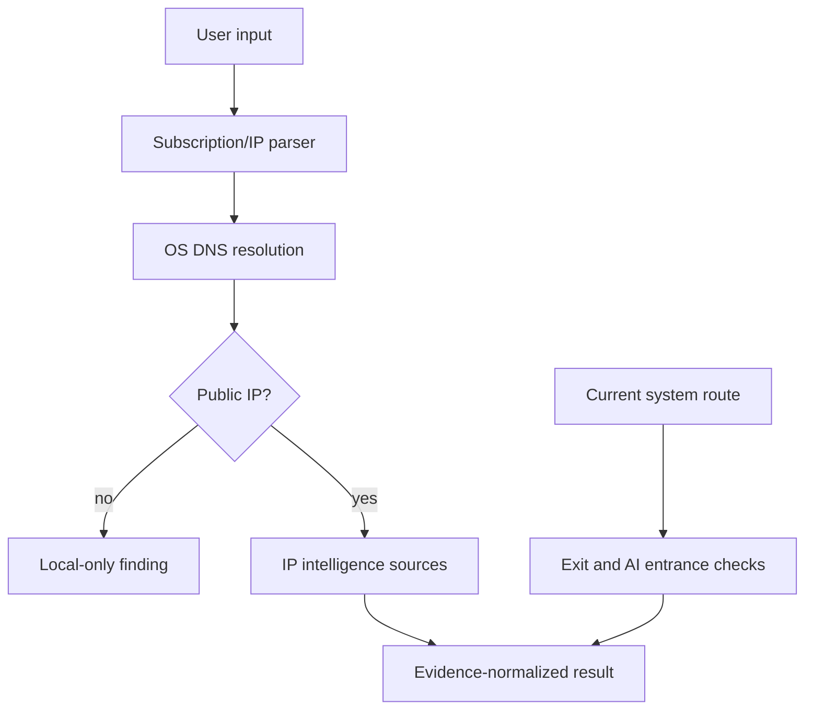

# Architecture and trust model

## Components

The Python package is the reference implementation for Windows, Linux, terminal and scripts. Android and iOS are native clients because background execution, secure storage and network-policy APIs differ significantly by operating system.

## Evidence model

Normalized display fields never erase source evidence. Each source has its own status, timestamp, elapsed time, payload-derived fields and sanitized error. A merged country/ASN is a convenience view; conflicting source values remain visible in `evidence`.

Risk is not averaged. `risk_scores` maps every score to its originating provider. Boolean proxy/VPN/Tor/datacenter flags are cumulative signals, not proof of wrongdoing.

## Subscription flow

The downloader validates scheme, userinfo, host, resolved address class, redirect count and body size. Parsing accepts URI lists, nested Base64 and Clash/Mihomo YAML. Provider documents pass through the same downloader. The resolver reads only node server names and runs DNS; node port values never enter a connection API.

## AI conclusions

Direct entrance checks and node-IP inference are deliberately separate. Direct tests show only the response class seen over the current device route. Region-policy inference is versioned static evidence plus IP metadata. Neither path authenticates, submits a prompt, tests paid models or guarantees future availability.
