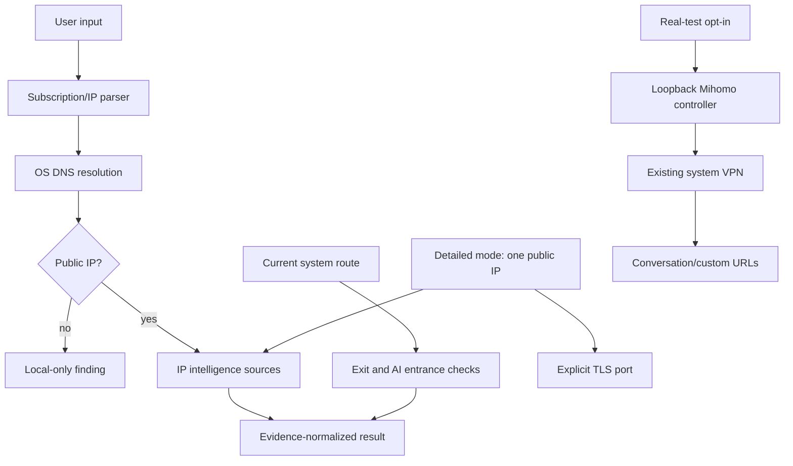

# Architecture and trust model

## Components

The Python package is the reference implementation for Windows, Linux, terminal and scripts. Android and iOS are native clients because background execution, secure storage and network-policy APIs differ significantly by operating system.

## Evidence model

Normalized display fields never erase source evidence. Each source has its own status, timestamp, elapsed time, payload-derived fields and sanitized error. A merged country/ASN is a convenience view; conflicting source values remain visible in `evidence`.

Risk is not averaged. `risk_scores` maps every score to its originating provider. Boolean proxy/VPN/Tor/datacenter flags are cumulative signals, not proof of wrongdoing.

## Subscription flow

The downloader validates scheme, userinfo, host, resolved address class, redirect count and body size. Parsing accepts URI lists, nested Base64 and Clash/Mihomo YAML. Provider documents pass through the same downloader. The resolver reads only node server names and runs DNS; node port values never enter a connection API.

## Detailed investigation flow

Detailed mode accepts exactly one public address. Passive registration, routing, security and rDNS lookups execute independently and retain their own timing/error records. Active target traffic is a TLS handshake only on the requested port list, defaulting to 443; there is no range scan. Hostnames discovered through passive/PTR evidence are used as SNI candidates only when current DNS resolves them back to the target IP. A domestic mirror is requested only after insufficient global geolocation results and is excluded from the high-confidence count.

## Real subscription test flow

The real-test branch deliberately starts after the ordinary safe parser. Node display names are intersected with a selectable group returned by a loopback Mihomo/Clash API. After TUN is confirmed, the tester records the baseline exit, switches a node, reads the group back to confirm it, records the new exit and sends capped anonymous requests to validated public conversation/custom URLs. The original node is restored in normal completion and error paths when the controller remains reachable. No proxy core or protocol credential is bundled.

## AI conclusions

Direct entrance checks, node-IP inference and explicit system-VPN real tests are deliberately separate. Direct tests show only the response class seen over the current device route. Region-policy inference is versioned static evidence plus IP metadata. Real tests switch a user-owned companion VPN and access the actual conversation URL, but anonymous automated probes still do not authenticate, submit a prompt, test paid models or guarantee future availability.
