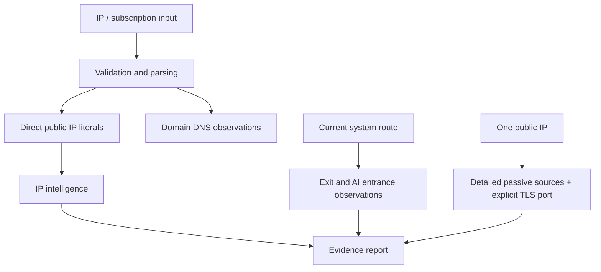

# Architecture and trust model

## Components

The Python package is the reference implementation for Windows, Linux, terminal and scripts. Android and iOS are native clients because lifecycle and secure-storage APIs differ. The userscript implements the subset a browser extension can safely expose.

There is intentionally no proxy data plane. No component converts credentials into a runtime proxy configuration, opens a node port, creates a TUN, modifies routes or controls an external proxy process.

## Evidence model

Each source record keeps its source name, query timestamp, elapsed time, success/error state and payload-derived fields. Normalized country, ASN and organization values are convenience views; conflicting values remain in `evidence` and `conflicts`.

Risk scores remain attached to their providers. Proxy/VPN/Tor/datacenter/abuse flags use four-state summaries such as confirmed, reported, conflicted and unknown. A missing keyed field is not converted to false.

Cache timestamps describe when this client fetched a record. They do not claim the upstream database measured every field at that moment.

## Subscription flow

1. Validate the supplied URL, credentials-in-URL policy, scheme, redirects, resolved address classes and body size.
2. Download the subscription and explicitly referenced provider documents.
3. Parse supported URI/Base64/YAML syntax into redacted node metadata.
4. Split node hosts:
   - A directly written public IP literal can enter IP-intelligence lookup.
   - A private/reserved literal is rejected locally.
   - A domain is resolved once and its public A/AAAA answers are retained only under `dns_observations`.
5. Report every subscription node's actual traffic exit as unobservable.

Node ports remain display metadata and never enter a socket API. DNS answers are infrastructure observations, not proof of the proxy endpoint's egress. A domain may front a CDN, load balancer or anycast system; a connected proxy may later exit from another address entirely.

## Detailed investigation flow

Detailed mode accepts exactly one public IP. Registration, routing, passive-security and rDNS requests run independently and retain their own timing/error records. Active target traffic is limited to TLS handshakes on explicitly requested ports, defaulting to 443; there is no port-range scan.

Hostnames learned from PTR/passive evidence become SNI candidates only when current forward DNS maps them back to the target IP. Even then, shared hosting and time-varying DNS can produce a certificate that does not describe every service on the address.

The domestic auxiliary source runs only after insufficient global geolocation results. It is labeled lower trust, does not replace failed authoritative sources and cannot raise confidence to high by itself.

## AI evidence separation

The application never derives a service verdict from country code.

- Current-route probes record anonymous HTTP observations only.
- IP metadata records geolocation, network ownership and vendor risk claims only.
- Official policy URLs are dated references with an explicit product scope.
- Logged-in conversation capability is not tested.

A 2xx response does not prove login or conversation success. A redirect can be login, consent, localization or policy. An unauthenticated API 400/401/403 proves only that a frontend responded. A web 403 may be WAF, bot challenge, IP reputation or policy; without explicit response evidence its cause is unknown.

## Background execution

Android foreground services keep a user-started job visible in notifications but confer no privileged network ability. iOS receives only finite best-effort background time. Windows/Linux monitor loops run only after the user starts them or installs the provided user-level service/task. A userscript remains bound to browser and extension lifecycle.
